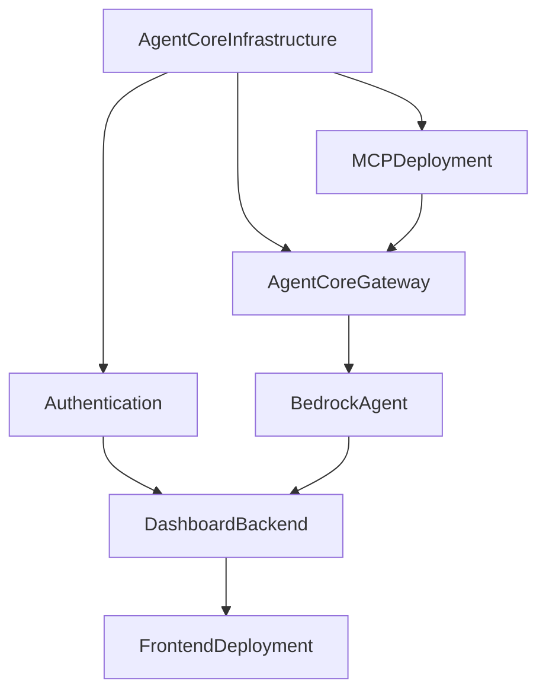
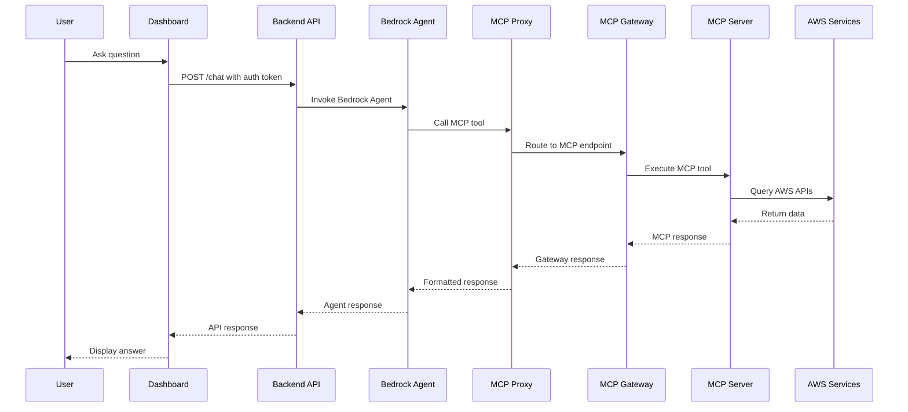
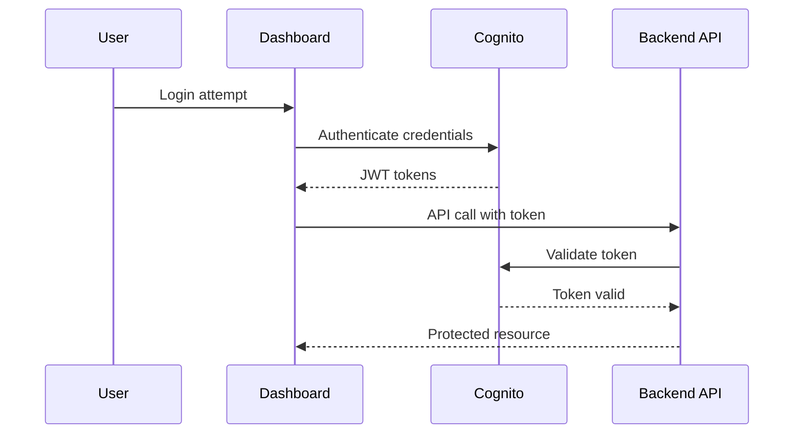

# Executive Security ROI Analytics - Developer Guide

## 🏗️ Complete Project Structure & Component Guide

This guide provides a comprehensive overview of the project architecture, component locations, and development patterns used in the Executive Security ROI Analytics solution.

---

## 📁 Project Structure Overview

```
executive-security-roi-analytics/
├── 📋 Project Documentation
│   ├── README.md                     # Project overview and quick start
│   ├── DEPLOYMENT_GUIDE.md           # Complete deployment instructions
│   ├── CHATBOT_PROMPTS_GUIDE.md      # Comprehensive chatbot usage examples
│   ├── DEVELOPER_GUIDE.md            # This file - project structure guide
│   ├── requirements.md               # Detailed requirements specification
│   ├── design.md                     # Architecture and design decisions
│   └── tasks.md                      # Implementation roadmap and progress
│
├── 🏗️ Infrastructure (AWS CDK)
│   ├── infrastructure/
│   │   ├── lib/                      # CDK stack definitions
│   │   ├── bin/                      # CDK app entry point
│   │   ├── cdk.json                  # CDK configuration
│   │   ├── package.json              # CDK dependencies
│   │   └── mcp_proxy.py              # Bedrock Agent MCP proxy function
│   │
├── 🤖 MCP Servers (AgentCore Runtime)
│   ├── mcp-servers/
│   │   ├── security-mcp/             # Security assessment MCP server
│   │   ├── cost-mcp/                 # Cost analysis MCP server
│   │   └── roi-analytics-mcp/        # ROI calculation MCP server
│   │
├── 🔌 Adapters
│   ├── adapters/
│   │   └── mcp-adapter/              # Bedrock Agent to MCP Gateway adapter
│   │
├── 🌐 Dashboard Application
│   ├── dashboard/
│   │   ├── frontend/                 # React TypeScript frontend
│   │   └── backend/                  # Lambda API backend
│   │
├── 📚 Documentation
│   ├── docs/
│   │   ├── api/                      # API documentation
│   │   ├── architecture/             # Architecture diagrams
│   │   └── deployment/               # Deployment guides
│   │
├── 🧪 Testing
│   ├── tests/
│   │   ├── unit/                     # Unit tests
│   │   ├── integration/              # Integration tests
│   │   └── e2e/                      # End-to-end tests
│   │
├── 🔧 Scripts & Utilities
│   ├── scripts/
│   │   ├── deploy.sh                 # Automated deployment script
│   │   ├── cleanup.sh                # Resource cleanup script
│   │   └── test.sh                   # Deployment testing script
│   │
└── 📦 Configuration
    ├── package.json                  # Root project configuration
    ├── .gitignore                    # Git ignore patterns
    └── active-todo-list.md           # Project completion tracking
```

---

## 🏗️ Infrastructure Components (CDK)

### Location: `infrastructure/`

#### Core CDK Structure
```
infrastructure/
├── bin/
│   └── infrastructure.ts            # CDK app entry point
├── lib/
│   ├── infrastructure-stack.ts      # Main stack orchestrator
│   ├── agentcore-stack.ts          # AgentCore runtime infrastructure
│   ├── mcp-deployment-stack.ts     # MCP Lambda functions deployment
│   ├── agentcore-gateway-stack.ts  # API Gateway for MCP routing
│   ├── bedrock-agent-stack.ts      # Bedrock Agent configuration
│   ├── auth-stack.ts               # Cognito authentication
│   ├── dashboard-backend-stack.ts  # Dashboard API backend
│   └── frontend-deployment-stack.ts # S3 + CloudFront frontend
├── mcp_proxy.py                    # MCP proxy Lambda function
├── cdk.json                        # CDK configuration
├── package.json                    # CDK dependencies
└── tsconfig.json                   # TypeScript configuration
```

#### Stack Dependencies & Deployment Order


### Key Infrastructure Components

#### 1. **AgentCore Infrastructure Stack**
- **File**: `lib/agentcore-stack.ts`
- **Purpose**: Core AgentCore runtime setup
- **Resources**:
  - IAM Role with comprehensive AWS permissions
  - S3 bucket for AgentCore artifacts
  - CloudWatch log group for centralized logging

#### 2. **MCP Deployment Stack**
- **File**: `lib/mcp-deployment-stack.ts`
- **Purpose**: Deploy all MCP server Lambda functions
- **Resources**:
  - 3 Lambda functions (Security, Cost, ROI)
  - Lambda layers for Python dependencies
  - IAM permissions for AWS service access

#### 3. **AgentCore Gateway Stack**
- **File**: `lib/agentcore-gateway-stack.ts`
- **Purpose**: API Gateway routing to MCP servers
- **Resources**:
  - REST API Gateway
  - Lambda integrations for each MCP server
  - CORS configuration

#### 4. **Bedrock Agent Stack**
- **File**: `lib/bedrock-agent-stack.ts`
- **Purpose**: Bedrock Agent with MCP tool integration
- **Resources**:
  - Bedrock Agent with Claude 3 Haiku
  - Agent action groups for MCP tools
  - MCP proxy Lambda function
  - IAM roles for Bedrock access

#### 5. **Authentication Stack**
- **File**: `lib/auth-stack.ts`
- **Purpose**: Executive user authentication
- **Resources**:
  - Cognito User Pool with strong password policy
  - User Pool Client for dashboard integration
  - Admin-only user creation policy

#### 6. **Dashboard Backend Stack**
- **File**: `lib/dashboard-backend-stack.ts`
- **Purpose**: Dashboard API and metrics endpoints
- **Resources**:
  - Lambda function for API handling
  - API Gateway with Cognito authorizer
  - Integration with Bedrock Agent

#### 7. **Frontend Deployment Stack**
- **File**: `lib/frontend-deployment-stack.ts`
- **Purpose**: React app hosting and distribution
- **Resources**:
  - S3 bucket for static hosting
  - CloudFront distribution with OAC
  - Automated deployment pipeline

---

## 🤖 MCP Servers (AgentCore Runtime)

### Location: `mcp-servers/`

Each MCP server follows the same structure pattern:

```
mcp-servers/{server-name}/
├── server.py                       # Main MCP server implementation
├── lambda_handler.py               # AWS Lambda wrapper
├── requirements.txt                # Python dependencies
├── setup.py                       # Package configuration
├── __init__.py                     # Python package marker
└── venv/                          # Virtual environment (created during setup)
```

### 1. **Security MCP Server**
- **Location**: `mcp-servers/security-mcp/`
- **Purpose**: AWS security services assessment
- **Tools Provided**:
  - `check_security_services`: Multi-region security status
  - `get_security_findings`: Detailed security findings with filtering
  - `check_compliance`: Encryption and compliance validation

**Key Features**:
- Multi-region support across all AWS regions
- Service-specific queries (GuardDuty, Security Hub, Inspector)
- Severity-based filtering (LOW, MEDIUM, HIGH, CRITICAL)
- Compliance checks for encryption, network security, access control

### 2. **Cost MCP Server**
- **Location**: `mcp-servers/cost-mcp/`
- **Purpose**: Security service cost analysis
- **Tools Provided**:
  - `get_security_service_costs`: Service-specific cost retrieval
  - `analyze_cost_trends`: Historical cost trend analysis
  - `get_cost_breakdown`: Detailed usage and regional breakdown
  - `forecast_costs`: Future cost predictions

**Key Features**:
- AWS Cost Explorer API integration
- Time-based cost analysis with flexible date ranges
- Multi-dimensional grouping (SERVICE, REGION, USAGE_TYPE)
- Trend analysis and forecasting capabilities

### 3. **ROI Analytics MCP Server**
- **Location**: `mcp-servers/roi-analytics-mcp/`
- **Purpose**: Security investment ROI calculation
- **Tools Provided**:
  - `calculate_security_roi`: Comprehensive ROI analysis
  - `analyze_cost_benefit`: Cost-benefit ratio calculations
  - `generate_roi_report`: Executive-focused reporting
  - `optimize_security_spend`: Spending optimization recommendations

**Key Features**:
- Advanced analytics with pandas/numpy
- Executive-focused reporting and insights
- Risk tolerance considerations
- Benchmarking against industry standards

### MCP Server Architecture Pattern

```python
# Common MCP server structure
class SecurityMCPServer:
    def __init__(self):
        self.server = Server("security-mcp")
        self._register_tools()
    
    def _register_tools(self):
        # Tool registration with input schemas
        pass
    
    async def handle_tool_call(self, name: str, arguments: Dict[str, Any]):
        # Tool routing and execution
        pass
    
    # Individual tool implementations
    async def _check_security_services(self, args):
        pass
```

---

## 🌐 Dashboard Application

### Location: `dashboard/`

### Frontend Structure: `dashboard/frontend/`

```
frontend/
├── public/
│   ├── index.html                  # Main HTML template
│   └── favicon.ico                 # Application icon
├── src/
│   ├── components/                 # React components
│   │   └── LoginForm.tsx          # Authentication form
│   ├── contexts/                   # React contexts
│   │   └── AuthContext.tsx        # Authentication state management
│   ├── services/                   # API service layers
│   │   ├── apiService.ts          # Backend API integration
│   │   └── bedrockService.ts      # Direct Bedrock integration (legacy)
│   ├── App.tsx                    # Main application component
│   ├── App.css                    # Application styles
│   ├── index.tsx                  # React entry point
│   ├── index.css                  # Global styles
│   └── aws-config.ts              # AWS SDK configuration
├── package.json                   # Frontend dependencies
├── tailwind.config.js             # Tailwind CSS configuration
└── tsconfig.json                  # TypeScript configuration
```

#### Key Frontend Components

**1. App.tsx - Main Application**
- Executive dashboard layout
- Metrics cards display (Security ROI, Monthly Spend, Security Score)
- Embedded chatbot interface
- Authentication state management

**2. AuthContext.tsx - Authentication Management**
- AWS Cognito integration
- Token management and refresh
- User session handling
- Protected route logic

**3. apiService.ts - Backend Integration**
- RESTful API calls to dashboard backend
- Authentication token handling
- Metrics data retrieval
- Chat message routing

### Backend Structure: `dashboard/backend/`

```
backend/
├── handler.py                     # Main Lambda handler
├── requirements.txt               # Python dependencies
└── (deployed as Lambda function)
```

#### Backend API Endpoints

**1. `/health` (GET) - Health Check**
- No authentication required
- Returns service status and timestamp

**2. `/metrics` (GET) - Dashboard Metrics**
- Requires Cognito authentication
- Returns real-time security metrics
- Calls MCP Gateway for live data

**3. `/chat` (POST) - Chatbot Interface**
- Requires Cognito authentication
- Routes messages to Bedrock Agent
- Handles streaming responses

#### Backend Architecture Pattern

```python
def lambda_handler(event, context):
    # Request parsing and routing
    # Authentication validation
    # Endpoint-specific handling
    # Response formatting with CORS
```

---

## 🔌 MCP Adapter Architecture

### Bedrock Agent to MCP Gateway Adapter

**Location**: Deployed via `infrastructure/lib/bedrock-agent-stack.ts`

#### Adapter Structure
- **Model**: Claude 3 Haiku (anthropic.claude-3-haiku-20240307-v1:0)
- **Architecture**: Single intelligent agent with MCP adapter integration
- **Action Groups**: Security tools with MCP adapter routing

#### MCP Adapter Function
**Location**: `adapters/mcp-adapter/mcp_proxy.py`

```python
def lambda_handler(event, context):
    # Extract tool information from Bedrock Agent
    # Route to appropriate MCP Gateway endpoint
    # Format response for Bedrock Agent compatibility
    # Return structured response with messageVersion
```

#### Agent Instructions Pattern
- Executive-focused language and responses
- Business impact emphasis
- Multi-tool orchestration capabilities
- Regional and service-specific query handling

---

## 📊 Data Flow Architecture

### Complete Request Flow



### Authentication Flow



---

## 🔧 Development Patterns

### CDK Development Pattern

```typescript
// Standard CDK stack pattern
export class ExampleStack extends Stack {
  constructor(scope: Construct, id: string, props?: StackProps) {
    super(scope, id, props);
    
    // Resource definitions
    // Cross-stack references
    // Output exports
  }
}
```

### MCP Server Development Pattern

```python
# Standard MCP server pattern
from mcp.server import Server
from mcp.types import Tool, TextContent

class ExampleMCPServer:
    def __init__(self):
        self.server = Server("example-mcp")
        self._register_tools()
    
    def _register_tools(self):
        @self.server.list_tools()
        async def list_tools() -> list[Tool]:
            return [Tool(name="example", description="Example tool")]
        
        @self.server.call_tool()
        async def call_tool(name: str, arguments: dict):
            return await self._handle_tool(name, arguments)
```

### React Component Pattern

```typescript
// Standard React component pattern
interface ComponentProps {
  // Props definition
}

const Component: React.FC<ComponentProps> = ({ props }) => {
  // State management
  // Effect hooks
  // Event handlers
  
  return (
    // JSX template
  );
};
```

---

## 🧪 Testing Strategy

### Test Structure: `tests/`

```
tests/
├── unit/                          # Unit tests for individual components
│   ├── mcp-servers/              # MCP server unit tests
│   ├── frontend/                 # React component tests
│   └── backend/                  # Lambda function tests
├── integration/                   # Integration tests
│   ├── api-tests/                # API endpoint tests
│   ├── mcp-integration/          # MCP server integration
│   └── auth-flow/                # Authentication flow tests
└── e2e/                          # End-to-end tests
    ├── dashboard-flow/           # Complete user journey tests
    └── chatbot-interaction/      # Chatbot functionality tests
```

### Testing Patterns

**Unit Tests**: Individual component functionality
**Integration Tests**: Component interaction validation
**E2E Tests**: Complete user workflow validation

---

## 📚 Configuration Management

### Environment Configuration

**CDK Configuration**: `infrastructure/cdk.json`
- CDK app settings
- Feature flags
- Build configuration

**Frontend Configuration**: `dashboard/frontend/.env`
- API endpoints
- AWS region settings
- Authentication configuration

**Backend Configuration**: Environment variables in Lambda
- Agent IDs and aliases
- Gateway URLs
- Service configurations

---

## 🔍 Monitoring & Observability

### CloudWatch Integration

**Log Groups**:
- `/aws/agentcore/security-roi-analytics` - MCP server logs
- `/aws/lambda/{function-name}` - Individual Lambda logs
- `/aws/apigateway/{api-id}` - API Gateway logs

**Metrics**:
- Lambda execution metrics
- API Gateway request metrics
- Bedrock Agent invocation metrics

### Debugging Patterns

**MCP Server Debugging**:
- CloudWatch logs with structured logging
- Error handling with detailed context
- Performance metrics and timing

**Frontend Debugging**:
- Browser developer tools
- React DevTools
- Network request monitoring

**Backend Debugging**:
- CloudWatch logs analysis
- X-Ray tracing (when enabled)
- API Gateway execution logs

---

## 🚀 Deployment Patterns

### Infrastructure Deployment
1. **Sequential Stack Deployment**: Dependencies handled automatically
2. **Environment Separation**: Dev/staging/prod through CDK contexts
3. **Resource Tagging**: Consistent tagging for cost allocation

### Application Deployment
1. **Frontend**: Build → S3 → CloudFront invalidation
2. **Backend**: Code → Lambda deployment package
3. **MCP Servers**: Virtual env → Lambda layers → Function deployment

### Configuration Management
1. **Stack Outputs**: Cross-stack resource references
2. **Parameter Store**: Runtime configuration values
3. **Environment Variables**: Service-specific settings

---

## 💡 Best Practices

### Code Organization
- **Separation of Concerns**: Clear component boundaries
- **Reusable Components**: Shared utilities and patterns
- **Type Safety**: TypeScript throughout frontend and CDK

### Security Practices
- **Least Privilege**: Minimal IAM permissions
- **Authentication**: Cognito integration with strong policies
- **Data Protection**: No sensitive data in logs or client-side code

### Performance Optimization
- **Lambda Cold Starts**: Optimized package sizes
- **Frontend Caching**: CloudFront and browser caching
- **API Efficiency**: Minimal data transfer and caching

### Maintainability
- **Documentation**: Comprehensive inline and external docs
- **Testing**: Unit, integration, and E2E test coverage
- **Monitoring**: Comprehensive logging and alerting

---

## 🔗 Component Relationships

### Dependency Map
```
Frontend ←→ Backend API ←→ Bedrock Agent ←→ MCP Proxy ←→ MCP Gateway ←→ MCP Servers ←→ AWS Services
    ↓           ↓              ↓              ↓            ↓             ↓
Cognito ←→ API Gateway ←→ Lambda ←→ Lambda ←→ API Gateway ←→ Lambda ←→ AWS APIs
```

### Data Flow Summary
1. **User Interaction**: Dashboard frontend
2. **Authentication**: Cognito JWT tokens
3. **API Routing**: Backend Lambda via API Gateway
4. **AI Processing**: Bedrock Agent orchestration
5. **Tool Execution**: MCP servers via proxy and gateway
6. **Data Retrieval**: AWS service APIs
7. **Response Chain**: Reverse path back to user

This developer guide provides the complete technical foundation for understanding, maintaining, and extending the Executive Security ROI Analytics solution.
